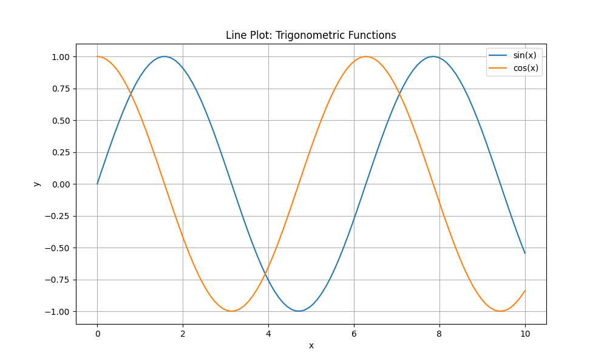
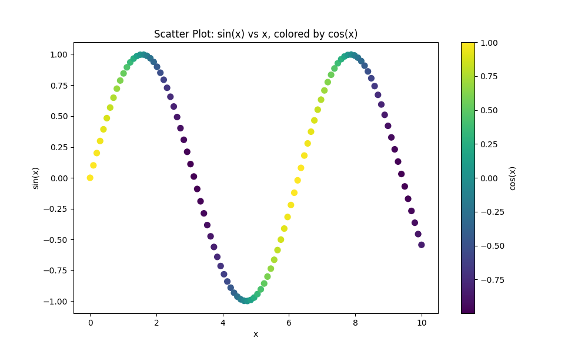
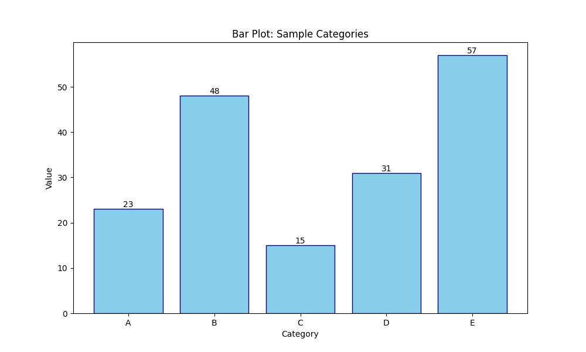
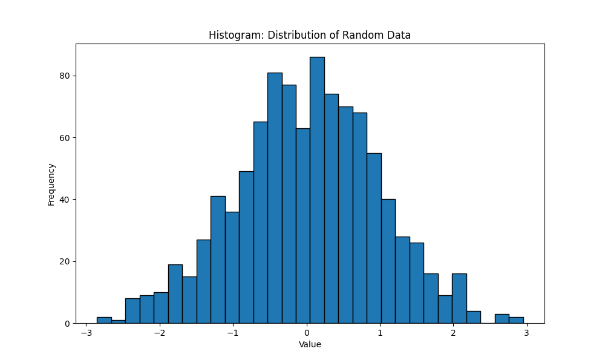
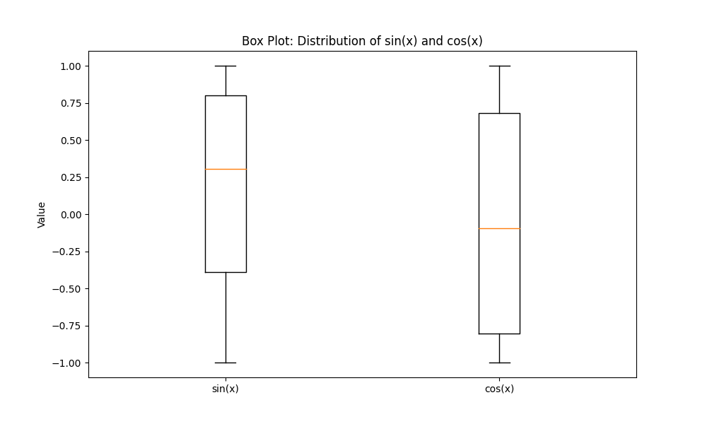
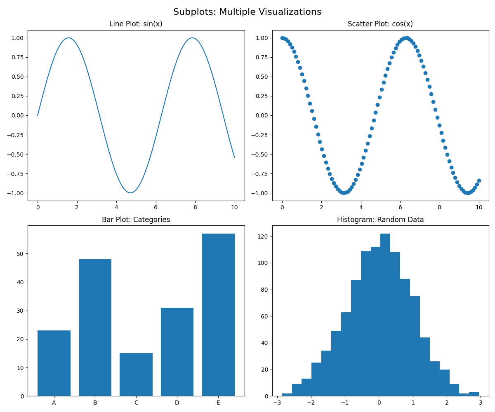

# Week 1, Day 7: Basic Statistics and Week Review

## Learning Goals

Today, I aimed to:
1. Understand and apply basic statistical concepts using Python
2. Explore various data visualization techniques with Matplotlib
3. Review and consolidate my learning from the entire week

## My Progress

1. [`basic_statistics.py`](./basic_statistics.py): Applying statistical concepts and reviewing week's learning
2. [`matplotlib_overview.py`](./matplotlib_overview.py): Exploring different types of plots and customizations in Matplotlib

## Key Concepts Covered

- Measures of central tendency (mean, median, mode)
- Measures of dispersion (variance, standard deviation)
- Data visualization for statistical analysis
- Probability distributions
- Correlation and covariance

## Week 1 Review

This week has been an intense dive into the world of data analysis. Here's a summary of what I've learned:

1. Python Basics: Variables, data types, control structures, functions
2. NumPy: Array creation, indexing, and operations
3. Pandas: Series and DataFrames, data loading, cleaning, and basic analysis
4. Basic Statistics: Descriptive statistics and data visualization

## Week 1 Final Reflection

As I wrap up this intense first week of my data analysis journey, I'm both exhausted and exhilarated. Here are my key takeaways:

1. **Python Fundamentals**: I've solidified my understanding of Python basics, which form the foundation for all the data analysis work.

2. **NumPy and Pandas**: These libraries are incredibly powerful. I've only scratched the surface but already see their potential for handling and analyzing data efficiently.

3. **Data Cleaning**: I've learned that real-world data is messy, and cleaning it is a crucial (and often time-consuming) part of the analysis process.

4. **Basic Statistics**: Understanding descriptive statistics and visualization techniques has given me tools to start making sense of data patterns.

5. **Learning Process**: This intensive approach has been challenging but rewarding. I've found that applying concepts to mini-projects helps solidify my understanding.

6. **Areas for Improvement**: I want to get more comfortable with Pandas and dive deeper into statistical concepts. I also need to practice more with real-world datasets.

7. **Next Steps**: I'm excited to build on this foundation, learn more advanced techniques, and start working with larger, more complex datasets.

## Next Steps

As I move into Week 2, I plan to:
1. Dive deeper into Pandas for more advanced data manipulation
2. Explore more complex statistical concepts and their applications
3. Start learning SQL for database operations
4. Begin working with larger, real-world datasets

### Data Visualization
I created various types of plots using Matplotlib:

<table>
  <tr>
    <td>Line Plot</td>
    <td>Scatter Plot</td>
    <td>Bar Plot</td>
  </tr>
  <tr>
    <td></td>
    <td></td>
    <td></td>
  </tr>
  <tr>
    <td>Histogram</td>
    <td>Box Plot</td>
    <td>Subplots</td>
  </tr>
  <tr>
    <td></td>
    <td></td>
    <td></td>
  </tr>
</table>

These visualizations helped me understand how to represent different types of data and relationships visually.
