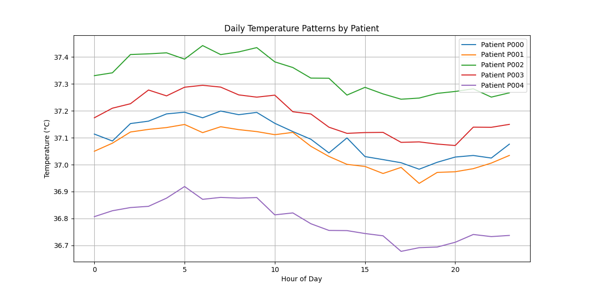
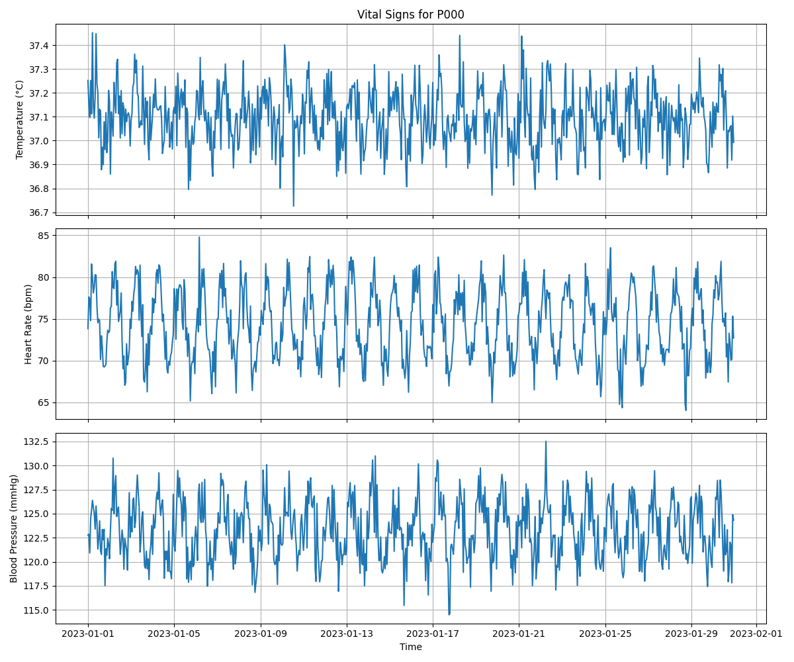
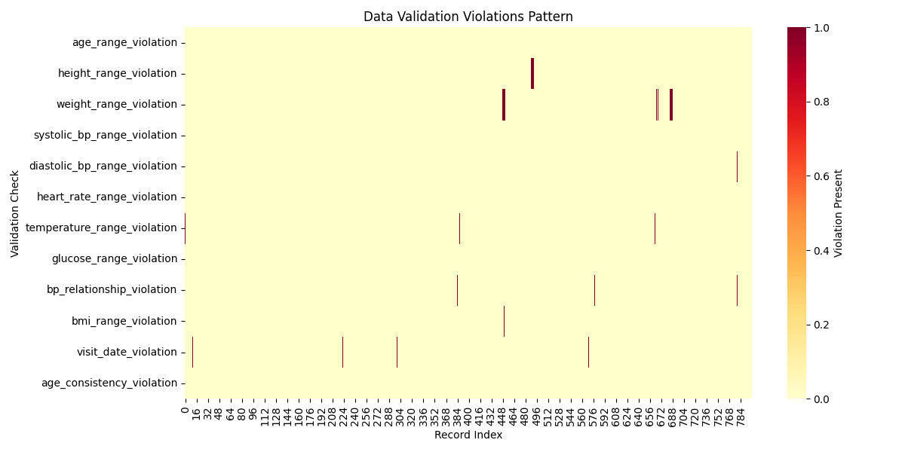
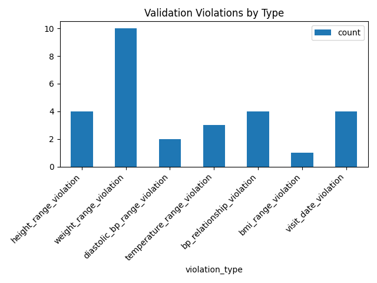
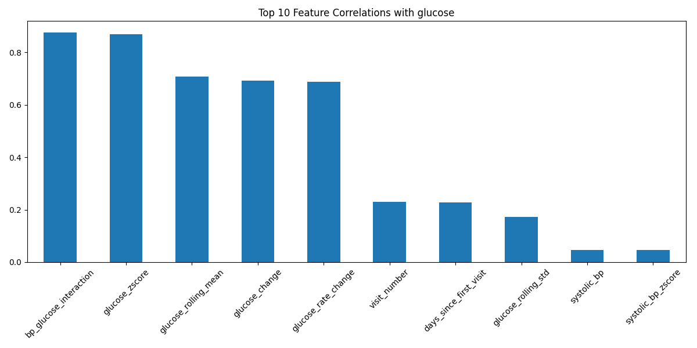
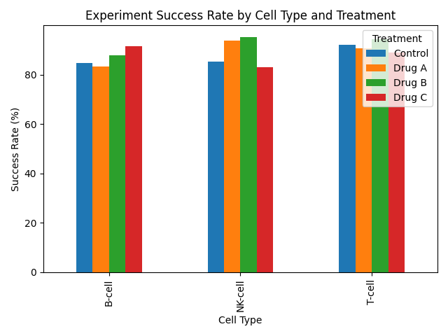

# Week 2: Databases & Real-World Data

## My Learning Goals

Building on my Python foundation from Week 1, I'm excited to dive into databases and real-world data analysis. By the end of this week, I aim to:

1. Master SQL fundamentals for data analysis
2. Get comfortable with advanced Pandas operations
3. Learn effective data cleaning techniques
4. Work with real-world datasets
5. Connect Python with databases

## Daily Breakdown

### [`Day 8-9`](./Day8-9): SQL Fundamentals
- Basic SQL queries (SELECT, WHERE, GROUP BY)
- Joins and relationships
- Aggregation functions
- SQLite with Python
- Mini-project: Building an analytics database

### [`Day 10-11`](./Day10-11): Advanced Pandas Operations
- Complex data transformations
- Grouping and aggregation
- Merging and joining datasets
- Working with time series data
- Mini-project: Advanced data analysis

### [`Day 12-13`](./Day12-13): Data Cleaning & Preprocessing
- Handling missing values
- Data normalization
- Feature engineering
- Dealing with outliers
- Mini-project: Cleaning a messy dataset

### [`Day 14`](./Day14): Data Integration
- Combining SQL and Pandas
- ETL processes
- Data validation
- Week review and reflection
- Capstone project: End-to-end data analysis

## Projects and Exercises

Throughout the week, I'll be working on several hands-on projects:

1. Building and querying a research database (Day 9)
2. Analyzing experimental results data (Day 11)
3. Cleaning and preparing research datasets (Day 13)
4. Creating an end-to-end data pipeline (Day 14)

## Resources I'm Using

- [SQLite Documentation](https://www.sqlite.org/docs.html)
- [Pandas Documentation - Advanced Topics](https://pandas.pydata.org/docs/user_guide/index.html)
- [Real Python - Working with Databases](https://realpython.com/python-sql-libraries/)
- [Kaggle Datasets](https://www.kaggle.com/datasets)

## Folder Structure

- [`/Day8-9`](./Day8-9): SQL basics and database connection scripts
- [`/Day10-11`](./Day10-11): Advanced Pandas operations scripts
- [`/Day12-13`](./Day12-13): Data cleaning and preprocessing scripts
- [`/Day14`](./Day14): Integration projects and weekly review

## My Progress and Results

### Data Visualizations
Throughout Week 2, I created various visualizations for analyzing clinical data:

<table>
  <tr>
    <td>Daily Temperature Patterns</td>
    <td>Patient Vital Signs</td>
    <td>Violation Patterns</td>
  </tr>
  <tr>
    <td></td>
    <td></td>
    <td></td>
  </tr>
  <tr>
    <td>Violation Counts</td>
    <td>Feature Correlations</td>
    <td>Success Rates</td>
  </tr>
  <tr>
    <td></td>
    <td></td>
    <td></td>
  </tr>
</table>

These visualizations helped me understand:
- Patient vital signs patterns over time
- Data quality issues and their distribution
- Relationships between different clinical measurements
- Treatment effectiveness across different groups